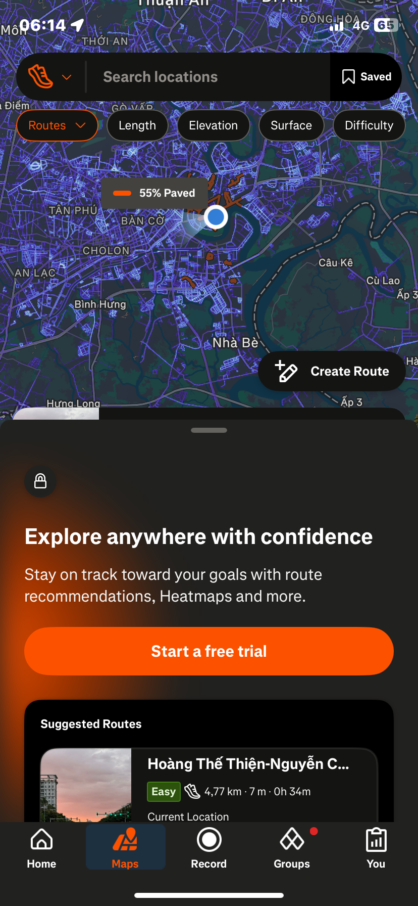
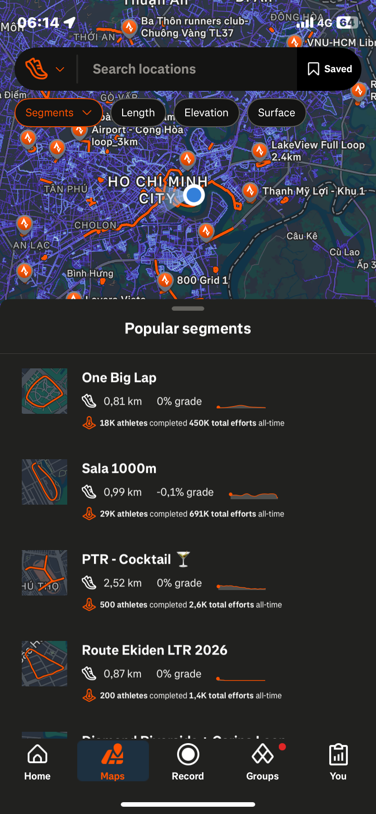

# I. Strava

## 1. Introduction

### a. Product Introduction

Strava is a phone and web app for tracking physical activity. A user starts a recording, and the app uses GPS to log distance, time, and pace while they walk, run, or cycle. After the activity ends, Strava turns the raw GPS data into stats (pace charts, elevation, personal records) and lets the user share it with a feed of friends, give and receive "kudos," and join clubs or challenges. In short, it is a GPS tracker with a social layer built on top.

This report is based on a first-time user's actual session with the free tier on an iPhone: one real walk recorded start to finish, plus exploring the Maps and Groups tabs afterward.

### b. User Goal

The main reason a user opens Strava is simple: **record an activity and see basic numbers afterward** — distance, time, pace. The first-time user in this project confirmed this directly: their idea of the app's core value was "press Start, Stop, Resume, Finish on a walk." Everything else — detailed pace breakdowns, route discovery, clubs, challenges — was only touched out of curiosity while testing the app, not because the user came looking for it.

### c. Primary Users

Strava's own trend data shows running is still the most-tracked sport on the platform, with racing growing. But most users are not competitive athletes — Strava reports that 93% of users say their main motivation is health, not competition. So the primary audience is closer to "people who want to stay active and see their own progress" than "serious racers."

### d. Secondary Users

- Casual walkers — walking is Strava's #2 most-recorded activity, right behind running. The walker in this project's test session represents a large, ordinary segment of users, not an edge case.
- Cyclists, swimmers, hikers, and triathletes.
- Competitive users who care about segment leaderboards and structured training data.
- Socially-driven users who join clubs and challenges — a segment that skews younger (Gen Z).
- Multi-sport users: 54% of users track more than one activity type, and 96% take part in more than one sport, so switching between activity types is normal, not rare.

### e. Device and Knowledge Requirements

**Device**: iOS or Android phone, or the strava.com web dashboard. The test session for this report used an iPhone. Strava also supports Wear OS, Apple Watch recording, and syncing from Garmin, Wahoo, Suunto, Polar, Fitbit, and Coros devices.

**Account tier**: Strava has a Free tier and a paid Subscription tier. The Free tier — used in this project — covers recording activities, joining the community, and safety features. The Subscription tier unlocks custom routes, offline maps, full training history, deeper workout analysis, goal tracking, segment leaderboards, and a fitness score. A first-time free user runs into upsell prompts often: "Start a free trial" or "Subscribe" banners appeared repeatedly across the Maps tab, the Workout Analysis screen, the You/Progress tab, the You/Workouts tab, and the Groups tab during the test session.

**Prior knowledge needed**: none for the core loop. The first-time user completed Start → Pause/Resume → Finish without hesitation or help. But secondary features — Segments, the Maps filter tabs, and the paywalled analytics — were not clear on first sight. The user had to tap around by trial and error to figure out what they did (see Use Case 3).

---

## 2. Use case 1: Record, Finish, and Save an Outdoor Walk

### a. Analyze use case 1

**Goal**: track distance, time, and pace for a walk in real time, then save it as a permanent record.
**Trigger**: user opens the Record tab and taps Start.
**Steps observed**:
1. In-progress recording screen — live map, live stats (Time/Distance/Speed), Pause button.

*IMG_0514 — In-progress recording screen: live map with Time/Distance/Speed and a Pause button.*
2. Tap Pause → Stopped screen — large-number stat display (Distance, Avg Speed), Resume/Finish buttons.

*IMG_0515 — Stopped screen: large-number Distance/Avg Speed display with Resume/Finish buttons.*
3. Tap Finish → Save Activity, screen 1 (title, description, activity type dropdown, map preview, tags).

*IMG_0517 — Save Activity screen 1: title/description fields, Walk type dropdown, map preview.*
4. Scroll to Save Activity, screen 2 ("How did that feel?", private notes, gear, Visibility setting, Mute Activity checkbox, Save Activity button).

*IMG_0518 — Save Activity screen 2: How did that feel, Visibility, Mute Activity, Save Activity button.*
5. Tap Save Activity → "Nice work!" transition animation.

*IMG_0519 — "Nice work!" transition animation screen.*
6. → "Welcome to the team, Duy!" first-activity achievement popup (View Activity / View in Trophy Case).

*IMG_0520 — "Welcome to the team, Duy!" first-activity achievement popup.*
7. → Share Activity sheet opens automatically (map + stats card, Share to Message/Strava Message/Strava Post/Copy Link/More).

*IMG_0522 — Share Activity sheet: map+stats card with Share to Message/Strava Post/Copy Link options.*

That is **5 separate screens between tapping Finish and reaching a stable end state** — not one confirmation.

### b. Context and method users interaction with this use case via interface

#### i. Context 1

- **Where**: Outdoors, on a real street.
- **When**: Early morning, around 06:09–06:15.
- **User Situation**: Walking — moving, not seated. This was the account's first-ever Strava activity, confirmed by the "Kudos on your first activity!" badge and the "Welcome to the team, Duy!" popup.
- **Interaction Method**: One-handed touch. The user's attention was split between watching the path ahead and glancing down at the phone to check pace and duration.
- **Expected Outcome**: An accurate record of the walk (distance, time, route), saved for later review. Sharing was expected to be optional, not automatic.

### c. Apply HCI principle (Benefit & Drawbacks)

#### i. Human capability

- **Benefit — foveal vision**: While walking, the user could only spare a quick downward glance at the phone before looking back at the path. The in-progress and Stopped screens put Time/Distance/Speed as large, high-contrast numbers centered on screen — exactly where that glance lands. This works because the eye only sees fine detail in a small central region (the fovea), so a number needs to sit right at that center point to be read in one look.
- **Drawback — visual-only feedback while walking**: Confirming Pause/Resume/Finish relies only on the visual channel — a button changing color or label. Human feedback can travel through sight, sound, or touch (vibration), and the walking user's eyes are already busy watching the road. A visual-only signal forces an extra look at exactly the moment the design should be minimizing eye movement.

#### ii. User mental model

- **Benefit — matches a real-world action**: Start → Pause/Resume → Finish maps directly onto "go for a walk, then stop." A mental model is the picture a person builds in their head of how something works, based on past experience — no new one was needed here. The user summed this up themselves: their idea of the app's core value was simply "press Start, Stop, Resume, Finish."
- **Drawback — Finish does not mean done**: The user expected Finish to mean "done — take me to the activity." Instead, the system inserted four more screens (the Save form, the "Nice work!" animation, the achievement popup, and the Share sheet) before reaching a stable state. In the user's own words: "What felt a bit different to me is that after I press Finish on a walk, it shows a screen to share the walk — that felt a bit strange." This breaks Shneiderman's Golden Rule #4, "design dialogs to yield closure" — a flow should let the user feel they have reached a clear end point, not keep pulling them into more steps right when they expect to be done.

#### iii. Interaction metaphors

- **Benefit — familiar icons**: The Resume/Pause icons (▶ / ❚❚) and the checkered-flag Finish icon borrow directly from media players and racing — domains the user already knows. No Strava-specific learning was needed to read them.

#### iv. Usability

- **Learnability**: High. A genuine first-time user with no prior Strava exposure operated the core recording loop without hesitation.
- **Efficiency**: Good during recording — few taps for Start/Pause/Resume — but it drops sharply right after Finish, where four extra, unrequested screens stand between the user and the point they considered the task done.
- **Errors**: None during the recording portion itself.

### d. Different User Types and Contexts

#### i. Beginners

This use case is a direct example of a beginner: someone with zero prior Strava exposure. They learned the core loop on the first attempt with no instructions.

#### ii. Experienced users

An experienced user would likely already know the Finish → Save → Share sequence from repeated use, so the surprise factor described above would fade over time — but the underlying extra taps would remain, so the efficiency cost stays even after the surprise disappears.

#### iii. Elderly users

The wide Pause/Resume/Finish button bar has large touch targets, which generally helps users with reduced fine motor control or lower vision. This is a design strength worth keeping regardless of who uses the app.

#### iv. Users with disabilities

A user relying on a screen reader would depend entirely on the visual-only feedback gap described above — with no haptic or audio confirmation, state changes (Paused, Resumed, Finished) would not be announced through a non-visual channel unless the app's screen-reader labels handle it separately. This is a real risk given the current design relies on visual feedback alone.

#### v. Environmental constraints

The recorded session happened outdoors in daylight with a stable signal, so glare and GPS drift were not actually observed. Still, two conditions are worth flagging as potential risks, since they follow directly from how the screen and the tracking method are built: the recording screen uses a black background, which is more prone to glare under direct sunlight than a lighter one; and the live distance/pace numbers depend entirely on GPS signal, which commonly weakens in dense urban areas with tall buildings blocking the satellite view.

### e. Propose specific HCI-based solutions

- **Observed problem**: Finish is followed by four non-optional screens before the user reaches a stable state, breaking the "Finish = done" expectation.
  **Relevant HCI principle**: Shneiderman's Golden Rule #4 ("design dialogs to yield closure") and Golden Rule #7 ("support user control").
  **Why the solution works**: giving the user an explicit stopping point right after Finish restores closure at the moment they expect it, and lets them choose whether to continue into sharing instead of being pulled into it.
  **Solution**: right after Finish, show one lightweight screen — "Activity saved. View it now, or share later?" — with two clear buttons. Move the achievement popup and Share sheet behind a "share later" path instead of showing them automatically.

- **Observed problem**: Pause/Resume/Finish confirmation is visual-only, forcing a look at the screen while the user is walking and watching the path.
  **Relevant HCI principle**: feedback should use the channel that fits the situation — sight, sound, or touch — and design should minimize eye movement when a user's attention is needed elsewhere.
  **Why the solution works**: a haptic pulse can be felt without looking, so the user gets confirmation without taking their eyes off the road.
  **Solution**: add a short vibration on every state change (Start, Pause, Resume, Finish), so the user can confirm the action landed without glancing down.

---

## 3. Use case 2: Reviewing Post-Activity Stats

### a. Analyze use case 2

**Goal**: understand how the just-finished activity went — distance, pace, elevation, splits.
**Trigger**: user opens the saved activity and scrolls through its detail and analysis screens.
**Screens observed**:
- Activity detail screen (distance, moving time, elevation gain).

*IMG_0521 — Activity detail screen: Distance/Moving Time/Elevation Gain with Kudos banner.*
- Workout Analysis screen (laps, flyover map).

*IMG_0525 — Workout Analysis screen: Laps list and Flyover map.*
- Elevation chart.

*IMG_0526 — Elevation chart: Elevation Gain and Max Elevation.*
- Pace chart / metrics screen (Avg Pace, Moving Time, Avg Elapsed Pace, Elapsed Time, Fastest Split).

*IMG_0527 — Pace chart screen: Avg Pace/Moving Time/Avg Elapsed Pace/Elapsed Time/Fastest Split.*

### b. Context and method users interaction with this use case via interface

#### i. Context 1

- **Where / When / User Situation**: This review happened as part of the same testing session as the recorded walk, browsing the saved activity on the same iPhone.
- **Interaction Method**: Scrolling and tapping through a single-column stats screen.
- **Expected Outcome**: Quickly understand how the activity went by reading the displayed numbers.

### c. Apply HCI principle (Benefit & Drawbacks)

#### i. Human capability

- **Benefit — chunking**: Data is shown as large stat blocks and charts (elevation, pace) instead of dense tables. Grouping numbers this way, rather than as a long list, cuts down how much the eye has to scan and the brain has to hold at once.
- **Drawback**: Several similarly-named metrics sit close together with no label explaining what tells them apart — described concretely below.

#### ii. User mental model

- **Drawback — recall instead of recognition**: Avg Pace, Avg Elapsed Pace, Moving Time, and Elapsed Time are all shown with no visible cue explaining what separates them. Recognition means understanding something because a visible cue is right there; recall means having to remember the meaning with no cue at all — and recognition is always easier. Here the labels force recall. The user said it directly: "Things like Avg Elapsed Time, Elapsed Time, and Fastest Split — I don't understand what they're for."
- **Drawback — near-duplicate jargon**: "Elapsed Pace" sitting next to "Pace," and "Elapsed Time" next to "Moving Time," reads as barely-distinguishable jargon rather than plain language a user can tell apart at a glance. Good interface language should use words a normal user already understands, not near-identical technical terms.

#### iii. Interaction metaphors

The elevation and pace charts use standard line/area-chart conventions from everyday data visualization — no Strava-specific metaphor problem was observed on this screen.

#### iv. Usability

- **Learnability**: Low, specifically for this screen. The user could not tell apart several metric labels without outside help, which runs against a basic usability goal — a new user should be able to make sense of what they're looking at without needing to be taught.
- **Errors**: None happened directly, since this is a read-only screen. But the labeling confusion creates a real risk: a user could easily mix up Moving Time (time actually spent moving) with Elapsed Time (total time including pauses) when comparing their own runs over time.

### d. Different User Types and Contexts

#### i. Beginners

This is a direct example: a first-time user hit exactly this confusion on this screen.

#### ii. Experienced users

A user coming from another fitness-tracking app is more likely to already know the difference between "moving time" and "elapsed time," since this pairing is common across the fitness-app category — meaning this specific pair of labels causes less friction for them, though the near-duplicate "Pace" vs. "Elapsed Pace" wording is Strava-specific and would still be new to most users regardless of experience.

### e. Propose specific HCI-based solutions

- **Observed problem**: the user could not distinguish Avg Pace / Avg Elapsed Pace / Moving Time / Elapsed Time on the Pace chart screen.
  **Relevant HCI principle**: prefer recognition over recall, and use plain language instead of near-duplicate jargon.
  **Why the solution works**: putting the explanation right where the user is already looking turns a guessing task into a recognizing task — no memorizing required.
  **Solution**: add a small info icon next to each of these four labels, showing a one-line definition on tap (e.g., "Elapsed Time: total time including pauses. Moving Time: time spent actually moving."). Show this automatically the first time a user opens this screen, then let it be dismissed for future visits.

---

## 4. Use case 3: Exploring the Maps Tab (Segments)

### a. Analyze use case 3

**Goal**: discover nearby routes or segments to run or walk in the future.
**Trigger**: user taps the Maps tab from the bottom navigation.
**Screens observed**:
- Maps tab, Routes sub-view (Length/Elevation/Surface/Difficulty filters, Create Route button, Suggested Routes list).

*IMG_0529 — Maps tab, Routes sub-view: Length/Elevation/Surface/Difficulty filters and Suggested Routes.*
- Segments sub-tab / Popular segments screen (map with segment pins, "Popular segments" list showing distance, grade, and athlete/effort counts).

*IMG_0530 — Segments sub-tab: map with segment pins and Popular segments list.*

### b. Context and method users interaction with this use case via interface

#### i. Context 1

- **Where / When / User Situation**: Continued from the same first-time exploration session as Use Cases 1 and 2.
- **Interaction Method**: Tapping between multiple sub-tabs (Segments, Length, Elevation, Surface) by trial and error rather than understanding the labels upfront. The user said: "I had to try tapping several tabs before I understood."
- **Expected Outcome**: Understand what a "segment" is and how it's different from a "route," without outside help.

### c. Apply HCI principle (Benefit & Drawbacks)

#### i. Human capability

No specific vision, motor, or hearing constraint came up in this use case beyond normal touch interaction with a map screen.

#### ii. User mental model

- **Drawback — no existing mental model, and jargon with no explanation**: "Segment" is Strava-specific wording with no on-screen definition. The user had no prior idea what it meant, and the screen didn't build one for them: "No, I really didn't understand it... I had to try tapping several tabs before I understood."
- **Drawback — learned by trial and error, not recognition**: With no visible cue explaining "Segment," the user had to learn its meaning by trying — tapping around and observing what happened. Learning a feature by trial and error is far less efficient than being able to recognize its meaning at a glance from a clear label.

#### iii. Interaction metaphors

- **Drawback — same look, different difficulty**: The tab bar (Segments / Length / Elevation / Surface / Difficulty) gives every tab the exact same pill-button styling. But Length, Elevation, and Surface are self-explanatory filters, while Segments needs prior domain knowledge to understand at all. Giving them identical visual weight tells the user they're all equally easy to understand, which isn't true.

#### iv. Usability

- **Learnability**: Low for a first-time user. The label alone didn't explain the feature — understanding only came after actively tapping through multiple tabs.

### d. Different User Types and Contexts

#### i. Beginners

This use case is a direct example — the exact confusion observed in this session.

#### ii. Experienced users

A runner already familiar with "segments" from another platform such as Zwift or Garmin Connect would likely recognize the term immediately, since it's a shared convention across fitness apps, not something unique to Strava.

### e. Propose specific HCI-based solutions

- **Observed problem**: "Segments" was not understood on first sight and only became clear through trial-and-error tapping.
  **Relevant HCI principle**: speak the user's language instead of unexplained jargon, and favor recognition over recall.
  **Why the solution works**: a short, visible definition removes the need to guess or experiment — the user can read the meaning the moment they see the tab, instead of learning it by trial and error.
  **Solution**: the first time a user opens the Maps tab, show a one-line subtitle under the "Segments" label — for example, "Segments: timed sections other athletes compete on." This turns a trial-and-error task into a quick read.

---

## 5. Use case 4: Exploring Groups — Challenges & Clubs

### a. Analyze use case 4

**Goal**: explore what the Groups tab offers across its Active, Challenges, and Clubs sub-tabs. For Active and Challenges, this was open curiosity rather than a real need going in. For Clubs specifically, the user had one clear goal: find a running club active in their own area.
**Trigger**: user taps the Groups tab from bottom navigation.
**Steps observed**:
1. Groups Active tab ("Design Your Own Challenge" paywall plus joined-challenge progress bars).

*IMG_0532 — Groups Active tab: Design Your Own Challenge paywall and joined-challenge progress bars.*
2. Challenges tab, card with Join button ("July 5K Challenge" card, Join button, "Recommended For You" list).

*IMG_0533 — Challenges tab: July 5K Challenge card with Join button and Recommended For You list.*
3. Tap Join on the challenge card → the button changes state, but no screen changes.
4. Clubs tab / club discovery screen ("Create Your Own Strava Club" promo, "The Strava Club" banner).

*IMG_0534 — Clubs tab: Create Your Own Strava Club promo and The Strava Club banner.*

### b. Context and method users interaction with this use case via interface

#### i. Context 1

- **Where / When**: A separate session from the recorded walk.
- **User Situation**: Deliberately exploring the app's features rather than working through an urgent task. The user's own stated intent for Active/Challenges was curiosity; for Clubs, there was a real goal — finding a nearby running club.
- **Interaction Method**: The user's attention goes straight to the most visually prominent element on each card — the Join button — and taps it directly without reading the label first. In the user's own words: "When I see a club card or challenge card, I focus on the button and tap it without reading 'join'... and I assume I need to enter another space to see the detail page for this challenge."
- **Expected Outcome**: Tapping Join was expected to open a detail page for the challenge. For Clubs, the goal was to find a running club active near the user's own running location.

### c. Apply HCI principle (Benefit & Drawbacks)

#### i. Human capability

- **Drawback — a bright button pulls the eye before the card is read**: The user described this directly: "When I see a club card or challenge card, I focus on the button and tap it without reading 'join'..." The Join button's bright orange, primary-action styling is the strongest color contrast on the card. The eye's fine-detail vision only covers a small central area (the fovea); everything outside that spot is picked up through peripheral vision, which reacts to motion and strong contrast rather than detail. A high-contrast button works like that kind of attention-grabbing cue — it pulls the eye, and the tap, toward itself first, before the rest of the card ever gets read.

#### ii. User mental model

- **Drawback — the interface does the opposite of what the user expects**: The user's mental model was "tap the prominent element on a card, and I'll see more detail." The actual behavior was "tap Join, and only the button's own state changes — nothing else happens." The user described this exactly: "Nothing happens, the button just changes status. What I expect is that it jumps into more detail." And: "I got stuck trying to find the detail view by focusing on the button, without reading or thinking about what the button actually does." This is a precise mismatch between what the user expected a tap to do and what it actually did — not a vague complaint about a confusing card.

#### iii. Interaction metaphors

- **Drawback — two different actions look like one**: Join (which only changes a state) and "open detail" (which should navigate somewhere) sit on the same card with no visual line drawn between them. Similar things should look and behave similarly, and different things should look visibly different — here, two different operations share one surface with no distinction at all.

#### iv. Usability

- **Learnability**: Low — the user never found the detail view during this session, despite tapping through several challenge and club cards.
- **Feedback / Visibility**: The button's label change is enough feedback for the Join toggle itself. But for the separate action of viewing details, the interface gives no feedback and no visibility at all — from the user's point of view, that action doesn't exist on screen.
- **Satisfaction**: The user described the mismatch as not bothering them much, since they were testing rather than pursuing something urgent: "No. I feel normal. Maybe because I just wanna test." A user with a real, time-pressured goal — like actually wanting to join a specific challenge right now — would likely find the same missing feedback more frustrating, since they'd have no way to tell whether their tap did what they wanted.

**For Clubs specifically**: the user's actual goal — finding a running club active in their own area — was not met. When asked directly if they left feeling they had accomplished something, the answer was no. What the screen showed instead was a generic "Create Your Own Strava Club" promo and "The Strava Club" (Strava's own official club), with no location-based or activity-based club discovery visible anywhere on the tab. A task like "find a club near me" needs its own clear entry point on the screen; here, none exists, so a real user goal has nowhere to go.

### d. Different User Types and Contexts

#### i. Beginners

This use case is a direct example — the user's own first exposure to Groups, Challenges, and Clubs.

#### ii. Experienced users

A user already familiar with card-based social apps (event apps, group-listing apps) might already expect a convention where tapping the card body opens detail and a separate, smaller button performs a quick action — meaning the same mismatch could still trip them up, since Strava's cards don't separate those two actions at all.

### e. Propose specific HCI-based solutions

- **Observed problem**: Join and "open detail" share one tap target on the card with no visual distinction.
  **Relevant HCI principle**: similar things should behave similarly, and different things should look different (consistency and affordance).
  **Why the solution works**: giving each action its own distinct visual element tells the user exactly what each tap will do, before they tap it.
  **Solution**: make the card body itself tappable to open detail, and shrink the Join button into a smaller, clearly separate control — for example, a chevron icon on the card to signal "more detail," next to a visually distinct Join button.

- **Observed problem**: after tapping Join, the only feedback is the button's own label change — the "view details" action has no feedback or visibility anywhere.
  **Relevant HCI principle**: actions should give immediate, informative feedback, and every operation on screen should be visible to the user.
  **Why the solution works**: pairing the state-change confirmation with a direct next step tells the user both that their tap worked and what to do next.
  **Solution**: after Join, show a short confirmation with a direct link — for example, "Joined! Tap here to see challenge details."

- **Observed problem**: the user's real goal — finding a nearby running club — had no visible entry point anywhere on the Clubs tab.
  **Relevant HCI principle**: a screen should have a clear feature behind every common user goal it's meant to support.
  **Why the solution works**: adding a direct entry point turns a goal the interface currently ignores into one it actively supports.
  **Solution**: add a "Find a club near you" search or filter directly on the Clubs tab's landing view, instead of showing only "Create your own club" and the single official Strava Club.

---

## Notes on Scope and Evidence

This report covers Product 1 (Strava) only. Product 2 is a teammate's separate responsibility. The use cases above are limited to the flows this project directly tested with a real first-time user and matching screenshots: recording and saving a walk, reviewing its stats, browsing the Maps tab, and browsing the Groups tab. Other screens captured during the same session — the You tab's Workouts and Settings sub-tabs — were seen but not tested with a user goal attached, so they are left out of this report rather than written up as guesses.

The HCI reasoning in each use case's "Apply HCI principle" and "Propose specific HCI-based solutions" sections draws on three course sources: human capabilities and usability dimensions (feedback channels, visibility, affordances, consistency, recognition vs. recall, mental models, conceptual models, interface metaphors, chunking, and usability goals), Shneiderman's Eight Golden Rules and the UI design process (dialog closure, error prevention, informative feedback, user control), and task analysis (capturing a task's goal, its environment, and how it gets learned).
