# I. Strava

## 1. Giới thiệu

### a. Giới thiệu sản phẩm

Strava là ứng dụng theo dõi hoạt động thể chất qua GPS (đi bộ, chạy, đạp xe), có thêm lớp mạng xã hội: chia sẻ hoạt động, kudos, câu lạc bộ, thử thách.

Báo cáo dựa trên một phiên trải nghiệm thực tế lần đầu sử dụng ứng dụng, gói miễn phí trên iPhone: một buổi đi bộ được ghi từ đầu đến cuối, cùng việc khám phá tab Maps và Groups sau đó.

### b. Mục tiêu người dùng

Trong phạm vi phiên trải nghiệm này, giá trị cốt lõi được quan sát đối với người dùng lần đầu là "nhấn Start, Stop, Resume, Finish khi đi bộ" — ghi hoạt động và xem số liệu cơ bản (quãng đường, thời gian, tốc độ) ngay sau đó. Các tính năng khác — phân tích chi tiết, khám phá lộ trình, câu lạc bộ, thử thách — chỉ được khám phá vì tò mò trong lúc thử ứng dụng, không phải vì đó là nhu cầu ban đầu.

### c. Người dùng chính

Theo dữ liệu xu hướng của Strava, chạy bộ vẫn là môn được theo dõi nhiều nhất trên nền tảng, đua xe đang tăng. Nhưng phần lớn người dùng không phải vận động viên thi đấu: 93% nói động lực chính là sức khỏe, không phải cạnh tranh. Vì vậy nhóm người dùng chính gần với "người muốn duy trì vận động, theo dõi tiến bộ bản thân" hơn là "vận động viên đua nghiêm túc".

### d. Người dùng phụ

- Người đi bộ — hoạt động được ghi nhận nhiều thứ hai trên Strava, ngay sau chạy bộ. Người đi bộ trong phiên thử nghiệm của dự án đại diện một phân khúc lớn, bình thường, không phải trường hợp hiếm gặp.
- Người đạp xe, bơi lội, leo núi, ba môn phối hợp (triathlon).
- Người dùng cạnh tranh, quan tâm bảng xếp hạng đoạn đường (segment) và dữ liệu tập luyện có cấu trúc.
- Người dùng thiên về mạng xã hội, tham gia câu lạc bộ và thử thách — nhóm này nghiêng về người dùng trẻ hơn (Gen Z).
- Người dùng đa môn thể thao: 54% theo dõi hơn một loại hoạt động, 96% tham gia hơn một môn thể thao — chuyển đổi giữa các hoạt động là chuyện bình thường.

### e. Yêu cầu thiết bị và kiến thức

**Thiết bị**: điện thoại iOS/Android, hoặc web strava.com; phiên thử nghiệm dùng iPhone. Strava cũng hỗ trợ Wear OS, ghi hoạt động trên Apple Watch, và đồng bộ từ Garmin, Wahoo, Suunto, Polar, Fitbit, Coros.

**Gói tài khoản**: gói Free (dùng trong dự án) gồm ghi hoạt động, tham gia cộng đồng, tính năng an toàn. Gói trả phí mở khóa lộ trình tùy chỉnh, bản đồ ngoại tuyến, lịch sử tập luyện đầy đủ, phân tích chuyên sâu hơn, theo dõi mục tiêu, bảng xếp hạng đoạn đường, và điểm số thể lực. Lời mời nâng cấp ("Start a free trial"/"Subscribe") xuất hiện lặp lại ở nhiều màn hình: tab Maps, Workout Analysis, You/Progress, You/Workouts, và tab Groups.

**Kiến thức cần có trước**: không cần gì cho vòng lặp cốt lõi. Trình tự Start → Pause/Resume → Finish hoàn thành ngay trong lần trải nghiệm đầu tiên, không do dự — phù hợp với đặc điểm của người dùng mới/lần đầu (novice/first-time). Nhưng các màn hình phân tích phụ, bị khóa sau gói trả phí, thì không rõ ràng ngay từ lần nhìn đầu tiên.

---

## 2. Tình huống sử dụng 1: Ghi lại, Kết thúc, và Lưu một buổi Đi bộ ngoài trời

### a. Phân tích tình huống sử dụng 1

**Mục tiêu**: theo dõi quãng đường, thời gian, tốc độ theo thời gian thực, sau đó lưu lại thành bản ghi lâu dài.
**Điều kiện tiên quyết**: đã đăng nhập tài khoản Strava; ứng dụng đã được cấp quyền truy cập GPS (ngụ ý từ việc bản đồ và số liệu vị trí hoạt động xuyên suốt phiên ghi).
**Tác nhân kích hoạt**: mở tab Record, nhấn Start.
**Các bước quan sát được**:
1. Màn hình đang ghi hoạt động — bản đồ và số liệu trực tiếp (Time/Distance/Speed), nút Pause.
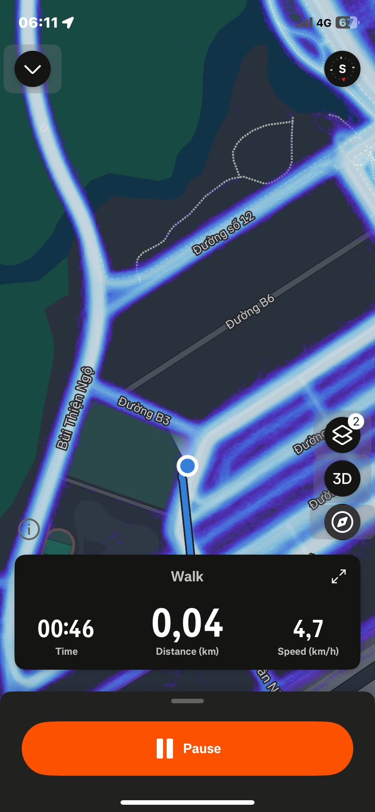
*IMG_0514 — Màn hình đang ghi hoạt động: bản đồ trực tiếp với Time/Distance/Speed và nút Pause.*
2. Nhấn Pause → màn hình Dừng — số liệu lớn (Distance, Avg Speed), nút Resume/Finish.
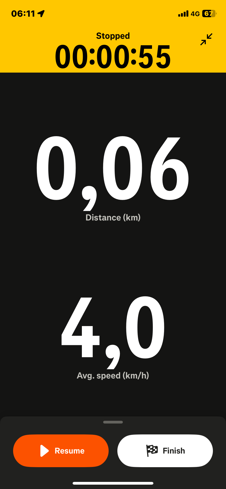
*IMG_0515 — Màn hình Dừng: số liệu lớn Distance/Avg Speed cùng nút Resume/Finish.*
3. Nhấn Finish → Save Activity màn 1 (tiêu đề, mô tả, loại hoạt động, xem trước bản đồ, tag).
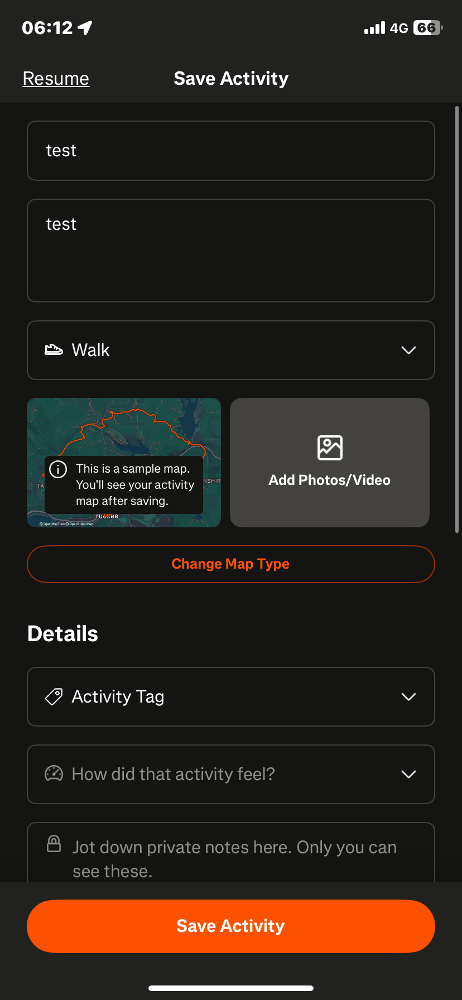
*IMG_0517 — Save Activity màn hình 1: tiêu đề/mô tả, loại Walk, xem trước bản đồ.*
4. Cuộn xuống Save Activity màn 2 ("How did that feel?", ghi chú riêng tư, gear, Visibility, Mute Activity, nút Save Activity).
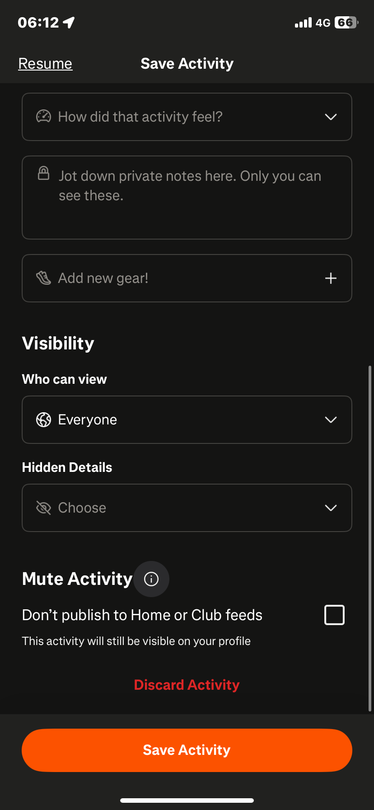
*IMG_0518 — Save Activity màn hình 2: How did that feel, Visibility, Mute Activity, nút Save.*
5. Nhấn Save Activity → hoạt ảnh chuyển cảnh "Nice work!".
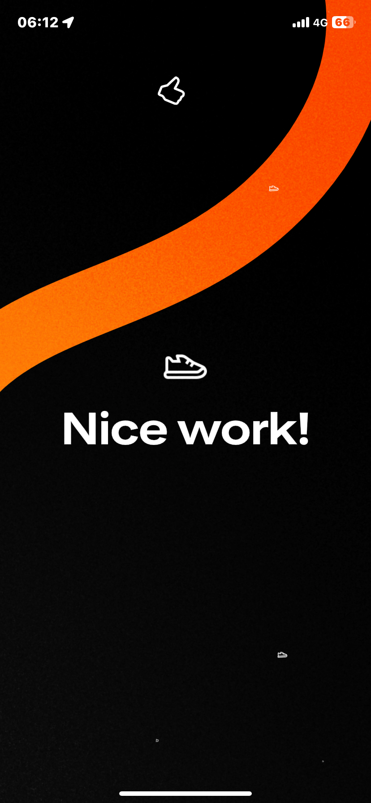
*IMG_0519 — Hoạt ảnh chuyển cảnh "Nice work!".*
6. → popup thành tích hoạt động đầu tiên "Welcome to the team, Duy!" (View Activity / View in Trophy Case).
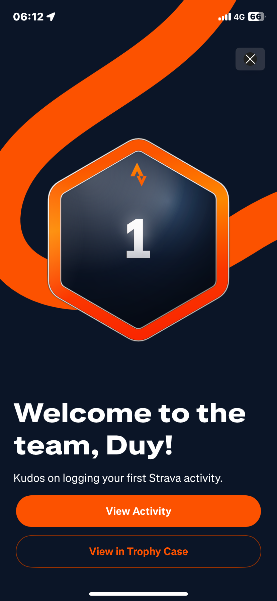
*IMG_0520 — Popup thành tích hoạt động đầu tiên.*
7. → bảng Share Activity tự động mở (thẻ bản đồ + số liệu, Share to Message/Strava Post/Copy Link/More).
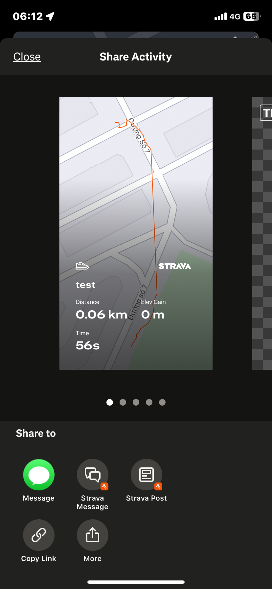
*IMG_0522 — Bảng Share Activity.*

Đó là **5 màn hình riêng biệt giữa lúc nhấn Finish và lúc đạt trạng thái ổn định** — không phải một lời xác nhận duy nhất.

### b. Bối cảnh và cách tương tác

- **Ở đâu / Khi nào**: ngoài trời, trên đường thật; sáng sớm, khoảng 06:09–06:15.
- **Tình huống**: đang đi bộ, di chuyển liên tục, không ngồi yên. Đây là hoạt động đầu tiên trên tài khoản, xác nhận qua badge "Kudos on your first activity!" và popup "Welcome to the team, Duy!".
- **Cách tương tác**: chạm một tay; sự chú ý chia giữa việc quan sát đường phía trước và liếc xuống điện thoại để kiểm tra tốc độ, thời lượng.
- **Kết quả mong đợi**: một bản ghi chính xác (quãng đường, thời gian, lộ trình), lưu lại để xem sau. Chia sẻ được kỳ vọng là tùy chọn, không phải tự động.

### c. Áp dụng nguyên lý HCI

**Giác quan và hệ vận động**

**Lợi ích.** Time/Distance/Speed đặt giữa màn hình dưới dạng số lớn, tương phản cao, phù hợp với vùng foveal vision — nơi mắt nhìn rõ chi tiết nhất — nên một lần liếc nhanh khi đang đi bộ là đủ để đọc.

**Hạn chế.** Xác nhận Pause/Resume/Finish chỉ dựa vào kênh thị giác (đổi màu/nhãn nút); một tín hiệu haptic (rung) sẽ phù hợp hơn ở đây vì mắt đang bận quan sát đường.

---

**Mô hình tư duy và ẩn dụ tương tác**

**Lợi ích.** Start → Pause/Resume → Finish khớp với mô hình tư duy quen thuộc ("đi bộ rồi dừng"); biểu tượng ▶/❚❚ và cờ ca-rô là ẩn dụ tương tác mượn từ trình phát nhạc và đua xe, không cần học riêng.

**Hạn chế.** Kỳ vọng "Finish = xong" không được đáp ứng: bốn màn hình thêm (Save, "Nice work!", popup thành tích, Share) xuất hiện trước khi đạt trạng thái ổn định — cho thấy luồng thao tác chưa tuân theo Shneiderman Rule #4 (design dialogs to yield closure).

---

**Khả năng sử dụng**

**Lợi ích.** Learnability cao trong lần trải nghiệm này — vòng lặp cốt lõi được thao tác đúng ngay từ đầu, không cần hướng dẫn. Errors không phát sinh trong phần ghi hoạt động.

**Hạn chế.** Efficiency tốt trong lúc ghi, nhưng giảm rõ ngay sau Finish do bốn màn hình phụ không được yêu cầu.

### d. Các loại người dùng và bối cảnh khác nhau

- **Người mới bắt đầu**: phù hợp với phiên trải nghiệm này — chưa từng tiếp xúc Strava trước đó, và vòng lặp cốt lõi được nắm bắt ngay trong lần thử đầu tiên mà không cần hướng dẫn nào.
- **Người dùng có kinh nghiệm**: nhiều khả năng đã quen trình tự Finish → Save → Share do dùng nhiều lần, nên yếu tố bất ngờ nói trên sẽ giảm dần theo thời gian — nhưng số lần chạm thừa vẫn còn đó, nên chi phí về hiệu suất vẫn tồn tại kể cả khi sự bất ngờ đã biến mất.
- **Người lớn tuổi**: thanh nút Pause/Resume/Finish rộng, vùng chạm lớn giúp thao tác dễ hơn — phù hợp với Fitts's Law, có lợi cho người có khả năng vận động tinh kém hơn.
- **Người khuyết tật**: nếu không có cơ chế phản hồi qua haptic hoặc âm thanh, người dùng phụ thuộc trình đọc màn hình có thể gặp khó khăn nhận biết các thay đổi trạng thái (Paused, Resumed, Finished), trừ khi nhãn dành riêng cho trình đọc màn hình xử lý việc này — điều chưa được kiểm chứng trực tiếp trong phiên trải nghiệm này.
- **Ràng buộc môi trường**: phiên ghi diễn ra ngoài trời, ban ngày, tín hiệu ổn định, nên chói nắng và trôi GPS không thực sự được quan sát thấy. Nhưng hai rủi ro tiềm ẩn vẫn đáng lưu ý: nền đen của màn hình ghi dễ chói hơn dưới ánh nắng trực tiếp so với nền sáng; và số liệu quãng đường/tốc độ phụ thuộc hoàn toàn vào tín hiệu GPS, vốn thường yếu đi ở khu đô thị đông đúc, nhà cao tầng che khuất vệ tinh.

### e. Đề xuất giải pháp dựa trên nguyên lý HCI

- **Vấn đề quan sát được**: Finish được theo sau bởi bốn màn hình không tùy chọn trước khi đạt trạng thái ổn định, phá vỡ kỳ vọng "Finish = xong".
  **Nguyên lý HCI liên quan**: Shneiderman Rule #4 (design dialogs to yield closure) và Rule #7 (support user control).
  **Vì sao giải pháp này hiệu quả**: một điểm dừng rõ ràng ngay sau Finish khôi phục cảm giác khép lại đúng lúc được mong đợi, và cho phép lựa chọn có tiếp tục sang việc chia sẻ hay không.
  **Giải pháp**: ngay sau Finish, hiện một màn hình nhẹ nhàng duy nhất — "Activity saved. View it now, or share later?" — với hai nút rõ ràng. Chuyển popup thành tích và bảng Share vào nhánh "chia sẻ sau" thay vì hiện tự động.

- **Vấn đề quan sát được**: xác nhận Pause/Resume/Finish chỉ qua thị giác, buộc phải nhìn màn hình trong lúc đang đi bộ và quan sát đường.
  **Nguyên lý HCI liên quan**: feedback nên dùng kênh phù hợp tình huống, và giảm thiểu di chuyển mắt khi sự chú ý cần ở nơi khác.
  **Vì sao giải pháp này hiệu quả**: một cú rung ngắn có thể cảm nhận được mà không cần nhìn, nên có xác nhận mà không phải rời mắt khỏi đường.
  **Giải pháp**: thêm một cú rung ngắn ở mỗi lần đổi trạng thái (Start, Pause, Resume, Finish).

---

## 3. Tình huống sử dụng 2: Xem lại số liệu sau khi hoàn thành hoạt động

### a. Phân tích tình huống sử dụng 2

**Mục tiêu**: hiểu hoạt động vừa hoàn thành — quãng đường, tốc độ, độ cao, các chặng (splits).
**Điều kiện tiên quyết**: một hoạt động đã được ghi và lưu thành công (kết quả của Tình huống sử dụng 1).
**Tác nhân kích hoạt**: mở hoạt động đã lưu, cuộn qua các màn hình chi tiết và phân tích.
**Màn hình quan sát được**:
- Chi tiết hoạt động (Distance/Moving Time/Elevation Gain, banner Kudos).
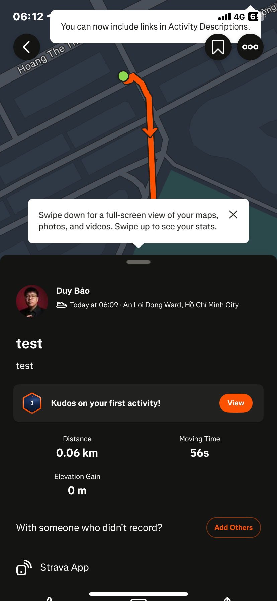
*IMG_0521 — Màn hình chi tiết hoạt động.*
- Workout Analysis (Laps, flyover map).
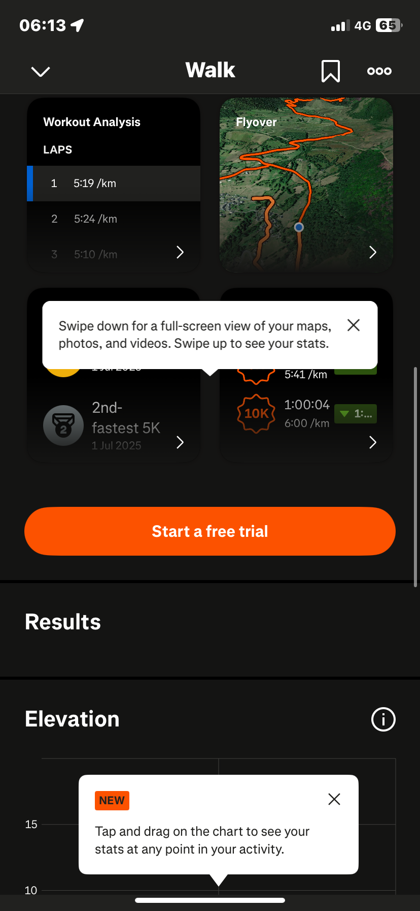
*IMG_0525 — Màn hình Workout Analysis.*
- Biểu đồ độ cao (Elevation Gain, Max Elevation).
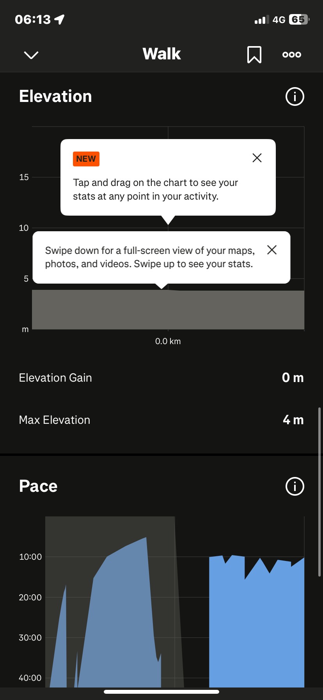
*IMG_0526 — Biểu đồ độ cao.*
- Biểu đồ tốc độ (Avg Pace, Moving Time, Avg Elapsed Pace, Elapsed Time, Fastest Split).
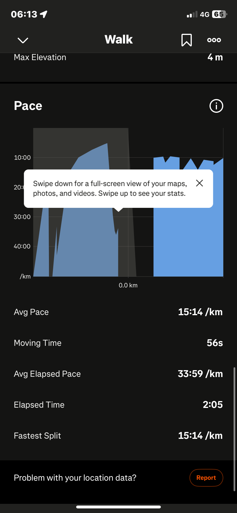
*IMG_0527 — Màn hình biểu đồ tốc độ.*

### b. Bối cảnh và cách tương tác

Cùng phiên thử nghiệm với buổi đi bộ đã ghi, xem lại hoạt động đã lưu trên cùng chiếc iPhone. Cách tương tác: cuộn và chạm qua một màn hình số liệu một cột. Kết quả mong đợi: hiểu nhanh buổi hoạt động diễn ra thế nào bằng cách đọc các con số hiển thị.

### c. Áp dụng nguyên lý HCI

**Chunking**

**Lợi ích.** Cách trình bày dữ liệu theo từng khối số lớn và biểu đồ riêng biệt (biểu đồ độ cao tách khỏi biểu đồ tốc độ) thay vì một bảng chung dày đặc — mỗi chỉ số chính (Distance, Moving Time, Elevation Gain) đứng riêng, dễ quét khi chỉ muốn kiểm tra một con số cụ thể.

**Hạn chế.** Trong cùng một khối hiển thị, một số chỉ số có tên gần giống nhau lại đặt liền nhau mà không có dấu phân biệt trực quan — Avg Pace và Avg Elapsed Pace, Moving Time và Elapsed Time — tạo ra gánh nặng nhận diện ngay trong vùng đã được tổ chức tốt.

---

**Recognition vs Recall**

**Lợi ích.** Toàn bộ số liệu đều hiển thị trực tiếp — không cần nhớ lệnh, không cần điều hướng thêm; chỉ cần đọc những gì đang hiện trên màn hình. Điều này về nguyên tắc là thiết kế hỗ trợ nhận diện (recognition).

**Hạn chế.** Khi các nhãn có tên gần giống nhau được đặt cạnh nhau — Avg Pace / Avg Elapsed Pace, Moving Time / Elapsed Time — người dùng không thể phân biệt chúng bằng cách nhìn nhãn; phải nhớ lại (recall) ý nghĩa của từng thuật ngữ thay vì nhận diện từ giao diện. Điều này đi ngược lại nguyên tắc ưu tiên nhận diện ngay trong phần vốn đã có lợi thế đó.

---

**Khả năng sử dụng**

**Lợi ích.** Màn hình là chỉ đọc (read-only) nên không phát sinh lỗi thao tác. Learnability cao với các chỉ số chính quen thuộc (Distance, Moving Time, Elevation Gain) vì chúng ngắn gọn và được hiển thị đủ lớn.

**Hạn chế.** Learnability thấp riêng ở nhóm nhãn gần giống nhau: không thể phân biệt Avg Pace với Avg Elapsed Pace, hay Moving Time với Elapsed Time, nếu không có trợ giúp bên ngoài — và nguy cơ nhầm hai chỉ số này khi so sánh các buổi tập là có thực.

### d. Các loại người dùng và bối cảnh khác nhau

- **Người mới bắt đầu**: phù hợp với trải nghiệm này — sự nhầm lẫn xảy ra ngay trong lần đầu tiếp cận màn hình.
- **Người dùng có kinh nghiệm**: người quen ứng dụng theo dõi thể chất khác nhiều khả năng đã biết sự khác biệt giữa "moving time" và "elapsed time", vì cặp thuật ngữ này phổ biến trong cả ngành ứng dụng thể chất — nghĩa là cặp nhãn này gây ít khó khăn hơn cho họ. Nhưng cách dùng từ gần giống nhau "Pace" so với "Elapsed Pace" là riêng của Strava, vẫn gây bỡ ngỡ bất kể kinh nghiệm.

### e. Đề xuất giải pháp dựa trên nguyên lý HCI

- **Vấn đề quan sát được**: không thể phân biệt Avg Pace / Avg Elapsed Pace / Moving Time / Elapsed Time trên màn hình biểu đồ tốc độ.
  **Nguyên lý HCI liên quan**: ưu tiên nhận diện hơn nhớ lại (recognition over recall).
  **Vì sao giải pháp này hiệu quả**: đặt lời giải thích ngay tại nơi đang nhìn biến một việc phải đoán thành một việc chỉ cần nhận diện, không cần ghi nhớ.
  **Giải pháp**: thêm một icon thông tin nhỏ cạnh mỗi nhãn trong bốn nhãn này, hiện định nghĩa một dòng khi chạm vào (ví dụ: "Elapsed Time: tổng thời gian bao gồm cả lúc dừng. Moving Time: thời gian thực sự di chuyển"). Hiện tự động lần đầu tiên mở màn hình này, sau đó cho phép tắt ở các lần xem sau.

---

## 4. Tình huống sử dụng 3: Khám phá Groups — Động lực, Cạnh tranh và Cộng đồng

### a. Phân tích tình huống sử dụng 3

**Mục tiêu**: đánh giá cách tab Groups thúc đẩy động lực, cạnh tranh, và duy trì tham gia — qua bốn cơ chế được quan sát: thử thách (Challenges), thanh tiến độ, thành tích (đã ghi nhận ở Tình huống sử dụng 1), và câu lạc bộ (Clubs). Riêng với Clubs, có thêm một mục tiêu cụ thể: tìm một câu lạc bộ chạy bộ đang hoạt động ở khu vực.
**Điều kiện tiên quyết**: đã đăng nhập tài khoản Strava; đang ở màn hình chính, có thể chạm tab Groups từ thanh điều hướng dưới.
**Tác nhân kích hoạt**: chạm tab Groups từ thanh điều hướng dưới.
**Các bước quan sát được**:
1. Tab Active — banner trả phí "Design Your Own Challenge" cùng thanh tiến độ của các thử thách đã tham gia.
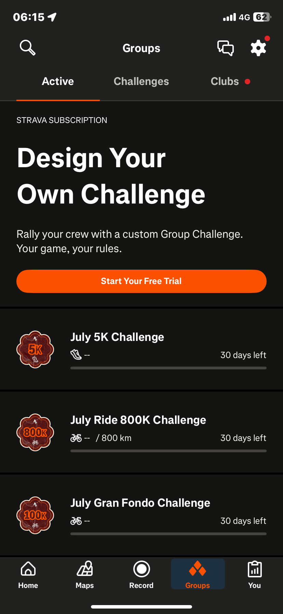
*IMG_0532 — Tab Groups Active: banner Design Your Own Challenge và thanh tiến độ thử thách đã tham gia.*
2. Tab Challenges, thẻ có nút Join ("July 5K Challenge", danh sách "Recommended For You").
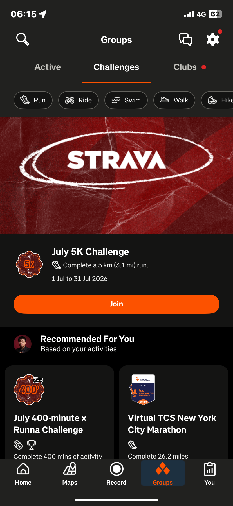
*IMG_0533 — Tab Challenges: thẻ July 5K Challenge với nút Join và danh sách Recommended For You.*
3. Chạm Join trên thẻ thử thách → nút đổi trạng thái, nhưng màn hình không đổi.
4. Tab Clubs — banner "Create Your Own Strava Club" và "The Strava Club".
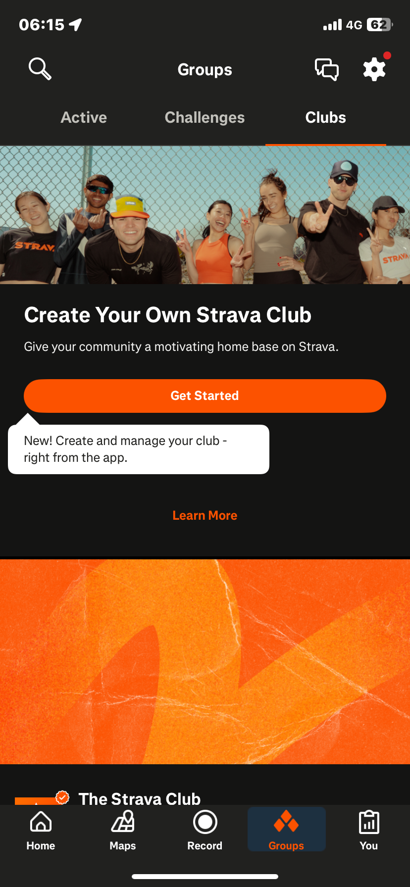
*IMG_0534 — Tab Clubs: banner Create Your Own Strava Club và The Strava Club.*

### b. Bối cảnh và cách tương tác

- **Bối cảnh**: một phiên riêng biệt so với buổi đi bộ đã ghi.
- **Tình huống**: chủ động khám phá, không xử lý nhiệm vụ gấp. Với Active/Challenges: tò mò; với Clubs: mục tiêu cụ thể — tìm câu lạc bộ chạy bộ gần nhà.
- **Cách tương tác**: sự chú ý đi thẳng đến nút Join — yếu tố tương phản cao nhất trên thẻ — trước khi phần còn lại của thẻ được đọc.
- **Kết quả mong đợi**: theo dõi được tiến độ của thử thách đã tham gia; với Clubs, tìm được một câu lạc bộ đang hoạt động gần khu vực.

### c. Áp dụng nguyên lý HCI

**Thử thách và thanh tiến độ (Feedback)**

**Lợi ích.** Thứ nhất, thanh tiến độ ở tab Active hiển thị liên tục mức độ hoàn thành của từng thử thách đã tham gia — nhìn vào là biết ngay mình đang ở đâu, không cần tính toán; đây là dạng feedback trực tiếp và rõ ràng. Thứ hai, thẻ thử thách ("July 5K Challenge") trình bày mục tiêu cụ thể (tên, khoảng cách, thời hạn) và nút Join dễ nhận diện — người dùng không cần tự đặt mục tiêu, chỉ cần chọn từ danh sách có sẵn.

**Hạn chế.** Sau khi nhấn Join, không có đường dẫn nào để xem lại chi tiết hay tiến độ của thử thách vừa tham gia — phản hồi duy nhất là nhãn nút đổi, sau đó không rõ theo dõi tiếp ở đâu: giao diện khuyến khích tham gia tốt nhưng chưa hỗ trợ bước theo dõi tiếp theo. Ngoài ra, nút "Design Your Own Challenge" hiển thị trên màn hình nhưng dẫn đến màn hình yêu cầu trả phí — người dùng nhìn thấy tùy chọn đó nhưng không thể dùng.

---

**Thành tích và xã hội (Feedback)**

**Lợi ích.** Popup thành tích (quan sát ở Tình huống sử dụng 1) và banner Kudos (Tình huống sử dụng 2) là những phản hồi giao diện được thiết kế rõ — cụ thể, xuất hiện ngay sau hoạt động, có tên gọi trực tiếp ("Welcome to the team, Duy!", "Kudos on your first activity!").

**Hạn chế.** Trong phiên trải nghiệm này, chưa thấy kết nối trực quan nào trên giao diện giữa các phản hồi đó với tab Groups — thành tích cá nhân và nội dung cộng đồng vận hành như hai luồng tách rời.

---

**Kết nối cộng đồng (Visibility)**

**Hạn chế.** Mục tiêu cụ thể "tìm câu lạc bộ gần khu vực" không có điểm truy cập nào trên tab Clubs; chỉ có nội dung quảng bá (tạo câu lạc bộ riêng, "The Strava Club" chính thức). Không có tính năng khám phá theo vị trí hay hoạt động nào hiển thị, làm giảm tính Visibility — các thao tác có thể thực hiện (tìm, lọc, khám phá câu lạc bộ) không được hiển thị — ngay từ màn hình đầu tiên.

---

**Join và trang chi tiết**

**Hạn chế.** Sự chú ý tập trung vào nút Join trước khi phần còn lại của thẻ được đọc; sau khi chạm, chỉ nhãn nút đổi, không mở được chi tiết. Đây là biểu hiện cụ thể, ở quy mô một tương tác đơn lẻ, của cùng khoảng trống feedback nêu trên — chứ không phải vấn đề trung tâm của tab Groups.

---

**Cảm nhận chung**: tab Groups có một số cơ chế giao diện hoạt động tốt — thanh tiến độ hiển thị rõ, thẻ thử thách dễ nhận diện, hệ thống thành tích và Kudos tạo phản hồi cụ thể sau mỗi hoạt động. Tuy nhiên, trong phạm vi phiên trải nghiệm này, hai mục tiêu chính — theo dõi thử thách đã tham gia và tìm câu lạc bộ — đều chưa đạt được, vì giao diện chưa cung cấp đường dẫn tiếp theo rõ ràng sau khi tham gia thử thách, và tab Clubs chưa có tính năng khám phá theo vị trí.

### d. Các loại người dùng và bối cảnh khác nhau

- **Người mới bắt đầu**: phù hợp với lần tiếp xúc đầu tiên với Groups, Challenges, và Clubs trong phiên này.
- **Người dùng có kinh nghiệm**: người quen ứng dụng xã hội dạng thẻ khác có thể kỳ vọng chạm thân thẻ để mở chi tiết, còn một nút riêng cho hành động nhanh — cách trình bày hiện tại của Strava không phân tách hai việc này, nên vấn đề thiếu chi tiết có thể vẫn xảy ra dù đã quen giao diện dạng thẻ.

### e. Đề xuất giải pháp dựa trên nguyên lý HCI

- **Vấn đề quan sát được**: sau khi Join, không có phản hồi hay lối vào xem chi tiết/tiến độ của thử thách.
  **Nguyên lý HCI liên quan**: Feedback (offer informative feedback).
  **Giải pháp**: sau khi Join, hiện xác nhận ngắn kèm liên kết trực tiếp — "Joined! Tap here to see challenge details and progress."

- **Vấn đề quan sát được**: không có điểm truy cập để tìm câu lạc bộ theo vị trí/hoạt động trên tab Clubs.
  **Nguyên lý HCI liên quan**: Visibility.
  **Giải pháp**: thêm một ô tìm kiếm hoặc bộ lọc "Find a club near you" ngay trên màn hình chính của tab Clubs.

---

## Ghi chú về Phạm vi và Bằng chứng

Báo cáo này chỉ bao gồm Sản phẩm 1 (Strava). Sản phẩm 2 là trách nhiệm riêng của một thành viên khác trong nhóm. Các tình huống sử dụng ở trên giới hạn trong những luồng thao tác được trải nghiệm trực tiếp, có ảnh chụp màn hình tương ứng: ghi và lưu một buổi đi bộ, xem lại số liệu của nó, và khám phá tab Groups. Các màn hình khác được chụp trong cùng phiên — tab Maps, và các tab con Workouts, Settings của tab You — đã được xem nhưng không viết thành tình huống sử dụng đầy đủ trong báo cáo này, nên được bỏ qua thay vì viết dựa trên phỏng đoán.

Lý luận HCI trong mỗi tình huống sử dụng dựa trên các khái niệm đã học trong môn: ba hệ con người (giác quan, nhận thức, vận động), các thứ nguyên khả dụng (learnability, efficiency, errors, satisfaction), chunking, recognition vs recall, mental model, interaction metaphor, feedback, visibility, Fitts's Law, cùng các nguyên lý liên quan trong Tám Quy tắc Vàng của Shneiderman; và khung phân tích nhiệm vụ (mục tiêu, điều kiện tiên quyết, các bước con, bối cảnh thao tác, cách học).
